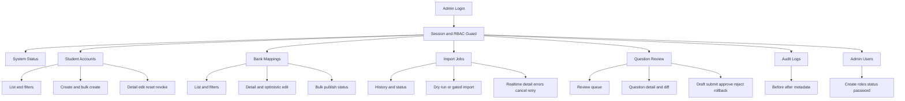
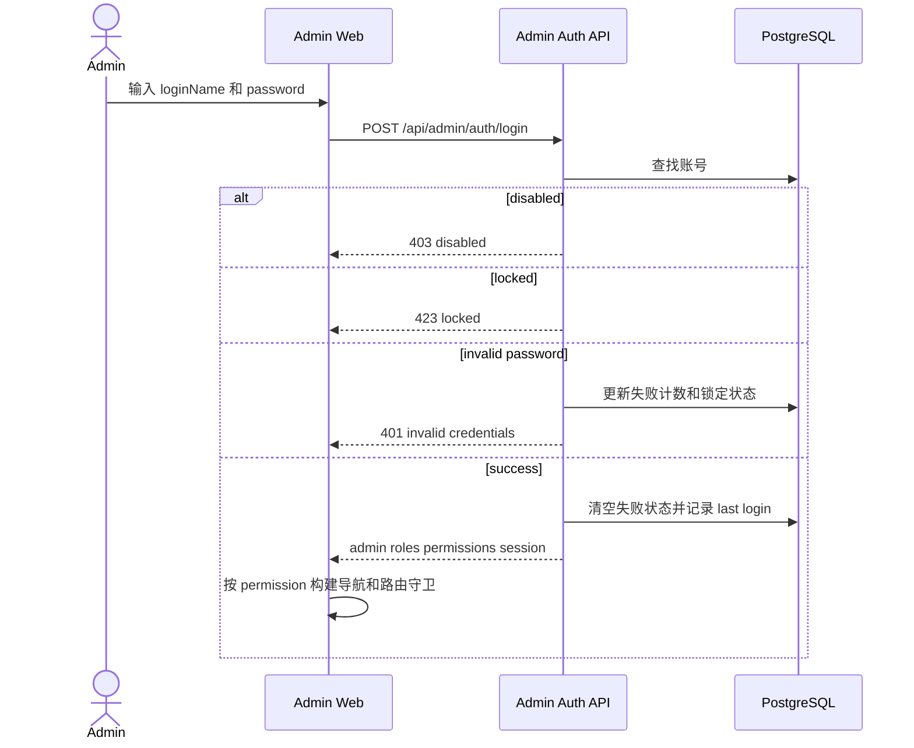
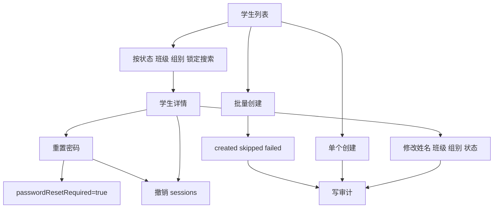
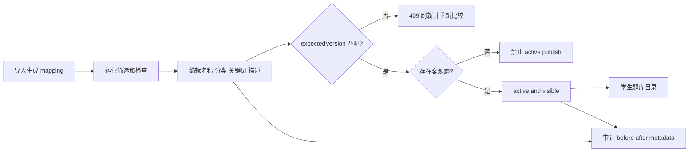
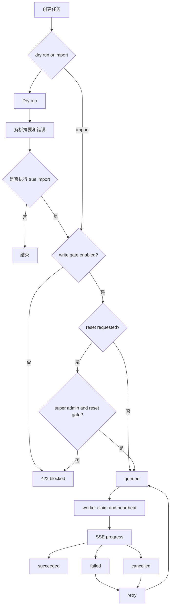
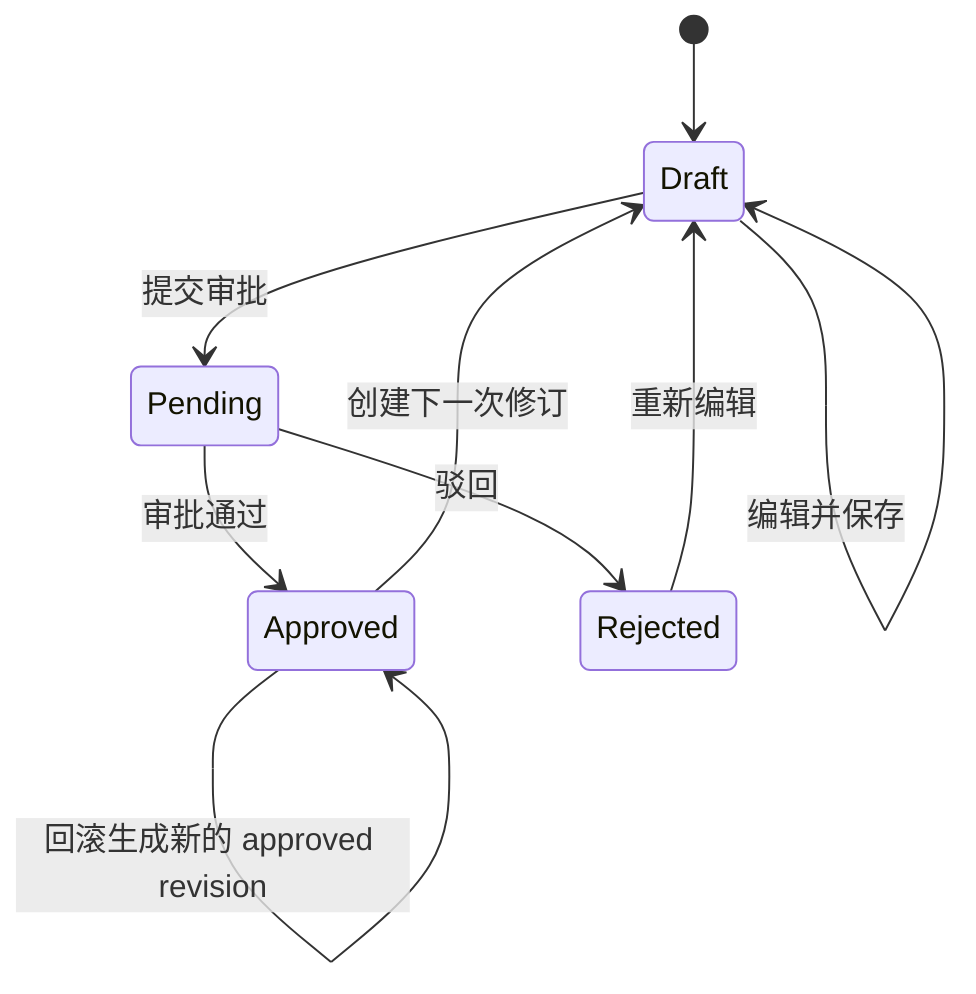
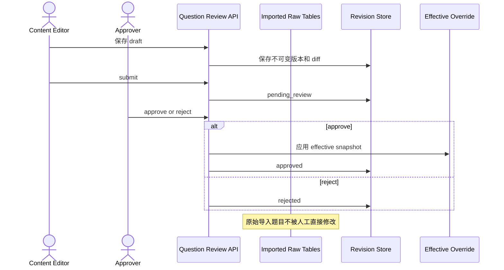

# Admin Information Architecture And Functional Flows

状态日期：**2026-07-17**

本文定义 Admin 平台的目标信息架构、角色边界和关键运营流程。它用于后续功能审核与正式视觉设计，不把 System Status 当作所有运营数据的万能 dashboard。

## 1. Admin 平台目标

Admin 平台服务三个责任域：

1. **账号运营**：学生账号、管理员账号和会话安全。
2. **内容运营**：题库 mapping、导入任务、题目质检和有效 override。
3. **系统治理**：系统状态、审计和高风险操作门禁。

## 2. 角色与权限

| 角色 | 主要职责 |
| --- | --- |
| `content_editor` | 题库整理、题目质检、草稿和内容修订 |
| `operator` | 学生账号、导入任务、系统状态 |
| `super_admin` | 全部权限、管理员账号、高风险 reset |

Import Jobs 权限已经拆分：

```text
import_job:read
import_job:create
import_job:cancel
import_job:retry
```

Question Review 审批使用独立：

```text
question_review:approve
```

内容编辑者不应默认审批自己的 pending revision。

## 3. 目标信息架构



## 4. 导航和页面矩阵

| 一级页面 | 主要读权限 | 写权限 | 关键状态 |
| --- | --- | --- | --- |
| System Status | `system_status:read` | 无 | DB/corpus/import/quality health |
| Student Accounts | `student_account:read` | write/reset/revoke | active/disabled/locked/reset required |
| Bank Mappings | `bank_mapping:read` | write/publish | draft/review/active/hidden/version conflict |
| Import Jobs | `import_job:read` | create/cancel/retry | queued/running/succeeded/failed/cancelled |
| Question Review | `question_review:read` | write/approve | draft/pending/approved/rejected/rollback |
| Audit Logs | `audit_log:read` | 无 | success/failure and actor/resource |
| Admin Users | `admin_user:manage` | manage | active/disabled/roles/last super admin |

未来如增加 Admin Dashboard，应新增独立 ops summary API，不应改变 System Status 的健康检查口径。

## 5. Admin 登录与 RBAC



## 6. Student Accounts 运营流



关键确认：

- 密码不进入 response/audit；
- reset 后默认撤销已有 session；
- disabled/locked/reset-required 状态必须清楚显示；
- bulk create 必须显示逐条失败，不只显示总数。

## 7. Bank Mapping 发布流



批量状态操作必须：

- 展示 `updated[]`；
- 展示 `failed[]`；
- version conflict 后刷新列表；
- 不把部分失败显示成整体成功。

## 8. Import Jobs 流程



操作规则：

- create/cancel/retry 使用独立权限；
- UI 显示 queued/running/terminal；
- SSE 断线使用 Last-Event-ID 恢复；
- reset 必须明确提示会级联删除学习数据；
- routine import 不允许 reset；
- error report 与 summary 不得输出密码或秘密环境变量。

## 9. Question Review 流程





## 10. Audit 和高风险操作

所有管理写操作至少记录：

- actor；
- action；
- resource type/id；
- before；
- after；
- metadata；
- result；
- timestamp。

高风险操作确认层级：

| 操作 | 确认 |
| --- | --- |
| 学生密码重置 | 明确将要求首次改密并撤销 session |
| 禁用管理员 | last-super-admin guard |
| mapping 发布 | objective question 检查和 version |
| true import | write gate |
| reset import | super_admin + reset gate + 维护窗口 |
| Question Review approve | 独立 approve permission |
| rollback | 选择历史 revision，禁止 no-op rollback |

## 11. 全局页面状态

Admin 页面统一处理：

- loading；
- empty；
- forbidden；
- unauthenticated/session expired；
- validation error；
- version conflict；
- partial success；
- destructive confirmation；
- background running/realtime reconnect；
- audit write failure或服务端失败。

## 12. 正式视觉开工条件

owner 在视觉设计前需要确认：

- 是否新增独立 Admin Dashboard；
- Student Accounts 是否需要导入文件而非 paste CSV；
- Bank Mapping 发布是否增加第二人审批；
- Question Review 批量审批的责任边界；
- Import error 下载和事件保留周期；
- 管理端主要使用 desktop 还是兼顾 tablet。

