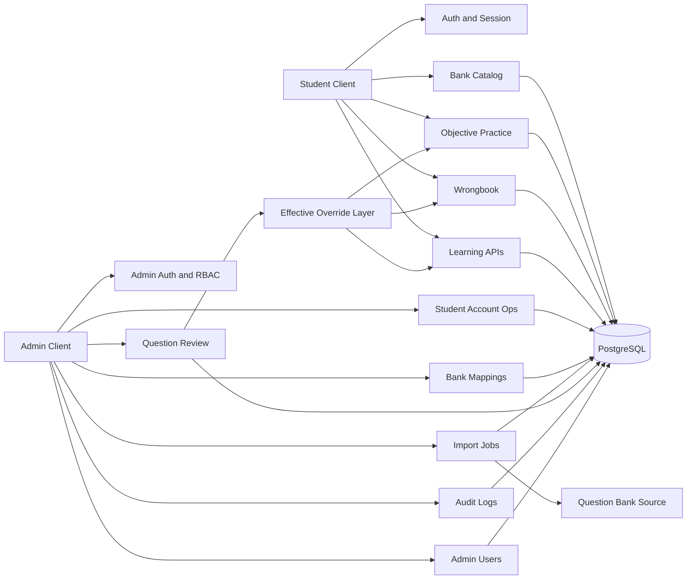

# Backend Final Closure

状态日期：**2026-07-17**

本文定义 BKYExam 当前后端范围的最终冻结点。这里的“后端完成”指：

- 学生客观题练习闭环；
- Wrongbook 与 Learning 后端；
- 正式学生/Admin 身份主链路；
- Admin 运营主工作流；
- Question Review 单题审批回滚；
- Import Jobs durable worker、实时进度与维护窗口导入；
- PostgreSQL migration、备份恢复、生产门禁和可重复质量验证。

它不表示填空、简答、编程、Office、材料题等完整平台愿景已经实现。

## 1. 本轮关闭的问题

### 1.1 Disabled Admin 登录顺序

Admin 登录在读取账号后先检查 `status`，再执行锁定和密码验证：

```text
unknown login -> invalid_credentials
disabled admin -> disabled
active locked admin -> locked
active admin -> verify password
```

禁用账号不会再进行密码验证，也不会因错误密码增加失败次数。

### 1.2 Import Jobs 权限分离

Import Jobs 写操作不再全部复用 `import_job:create`：

| 操作 | Permission |
| --- | --- |
| 创建任务 | `import_job:create` |
| 取消任务 | `import_job:cancel` |
| 重试任务 | `import_job:retry` |

`operator` 和 `super_admin` 当前仍拥有三项权限，但 API、shared contract 和 Admin UI 已形成独立边界，后续可以在不改路由的情况下调整角色策略。

### 1.3 Worker failed 中止

Import worker 的 cooperative abort 现在直接识别：

```text
heartbeat lost
job.status = cancelled
job.status = failed
```

stale recovery 或其他并发保护把任务标记为 `failed` 后，runner 不再只依赖 heartbeat 的间接变化。

### 1.4 冗余索引清理

新增：

```text
0016_import_job_index_cleanup.sql
```

它使用 forward migration 删除旧的：

```text
import_jobs_one_running_kind_idx
```

保留覆盖 queued/running 的：

```text
import_jobs_one_active_kind_idx
```

已发布 migration 不做原地修改。

## 2. 当前后端冻结边界



在该边界内，新前端开发应优先消费现有 shared v1 contract，不再为了页面布局随意改变后端对象和状态语义。

## 3. 不阻塞前端设计的后续事项

以下属于新功能或长期工程，不属于 Backend Final Closure：

- Question Review 批量审批、通知和 source drift report；
- Import 文件/行级错误下载和事件归档；
- 外部队列服务；
- 跨硬件长期容量阈值；
- 更细的 route validation/error helper 模块化；
- 学生账号找回、MFA、SSO；
- Learning 推荐策略和完整长期档案；
- 非客观题与复杂题型作答/评测。

## 4. 发布和运营边界

- `ADMIN_IMPORT_ENABLE_WRITE=false` 默认保持关闭。
- `ADMIN_IMPORT_ENABLE_RESET=false` 默认保持关闭。
- routine import 使用 `resetBeforeImport=false`。
- 全量导入仍属于维护窗口操作。
- 生产公开发布仍需第三方告警接收端和真实用户验收，这属于发布治理，不是当前 API 功能缺口。

## 5. 验证标准

本轮完成必须满足：

- shared/API/Admin typecheck；
- targeted Auth/RBAC/Import worker/route/migration tests；
- 全量 Vitest；
- Playwright；
- PostgreSQL integration 从空库执行 migrations `0001..0016`；
- migration second-run 全部 skipped；
- docs audit；
- production build。

验证结果在本阶段提交前写入 [`testing.md`](testing.md)、[`status.md`](status.md) 和 [`todo.md`](todo.md)。

## 6. 最终判断

完成本轮后，当前范围的后端状态定义为：

> **Backend Feature Freeze / 客观题与运营后端主干完成。**

后续允许：

- 修 bug；
- 补安全和可观测性；
- 为已确认的新产品功能增加新 contract。

后续不应：

- 因前端布局临时改变核心状态语义；
- 将未设计清楚的复杂题型塞入 objective grader；
- 绕过 override/revision 直接修改导入原题表；
- 把 reset import 当作日常运营操作。

