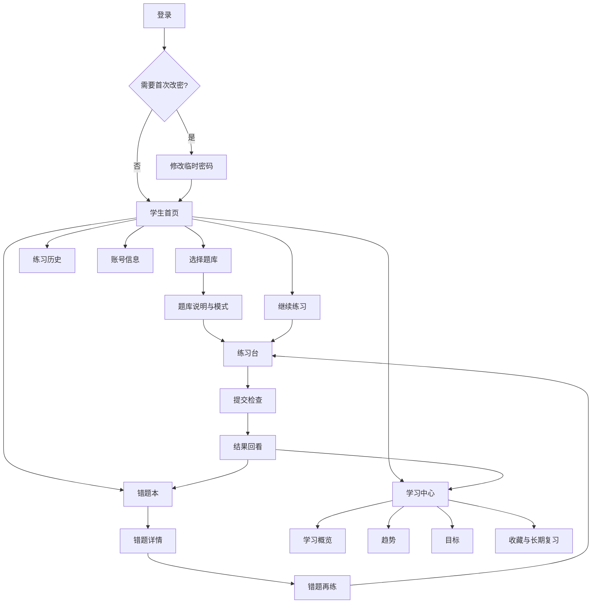
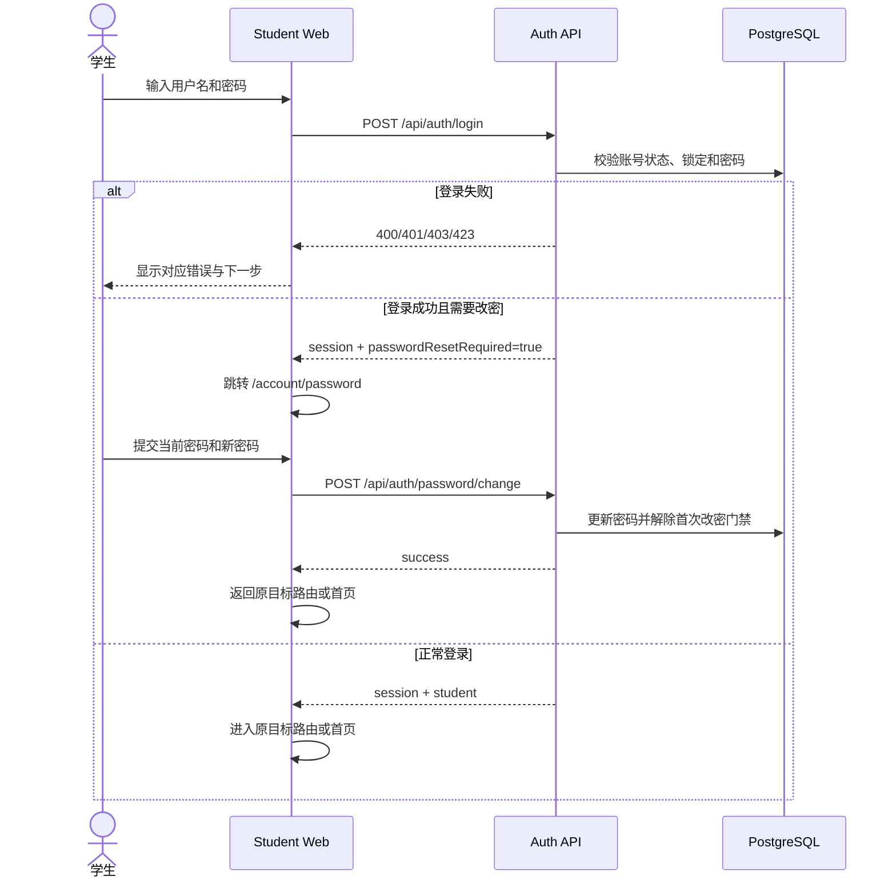
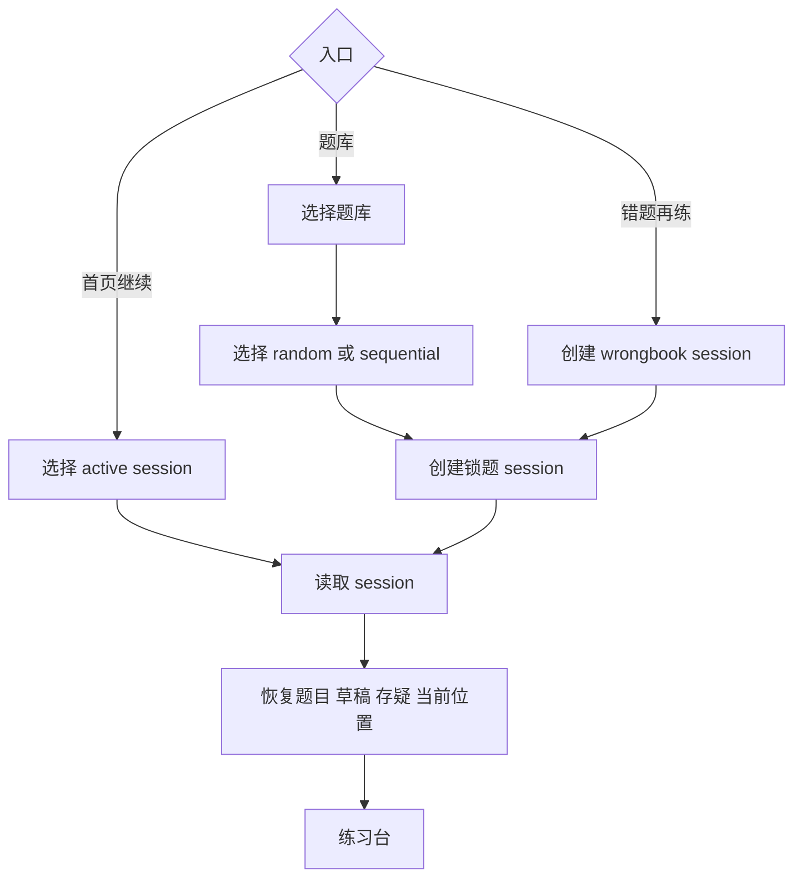
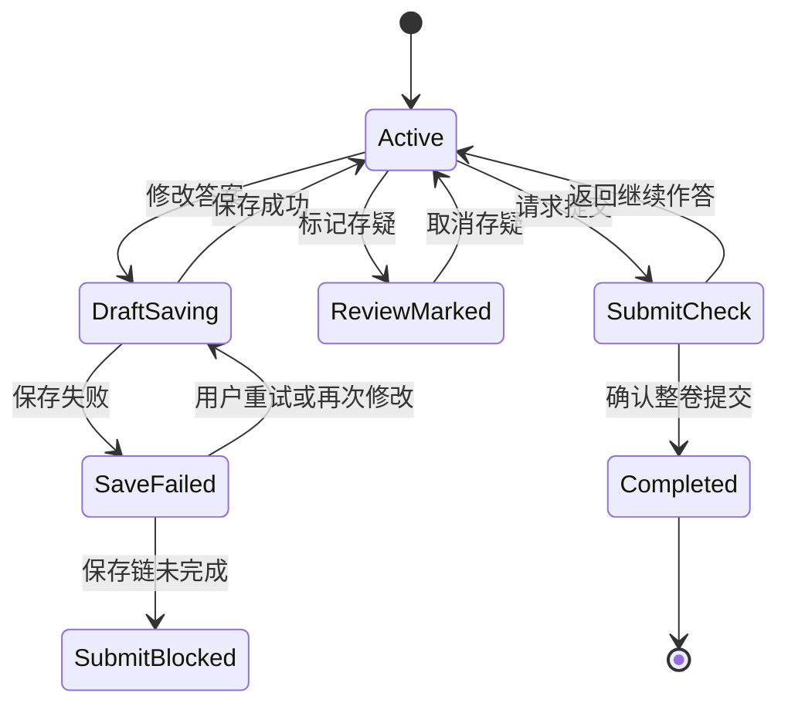
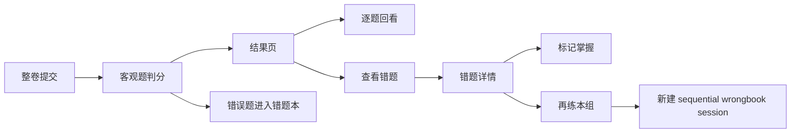
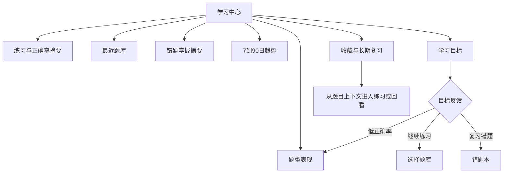

# Student Information Architecture And Functional Flows

状态日期：**2026-07-17**

本文是学生端后续产品审核和正式视觉设计的功能真相源。它描述页面对象、导航、状态和业务流程，不规定最终颜色、字体或组件风格。

## 1. 学生端目标

学生端第一目标不是“考试系统”，而是：

> 帮助学生快速进入练习、可靠保存过程、理解结果，并通过错题与学习反馈继续下一轮。

核心对象：

- 学生账号；
- 题库；
- 练习会话；
- 题目草稿；
- 提交结果；
- 错题；
- 学习目标；
- 收藏/长期复习标记。

## 2. 目标信息架构

### 页面状态

| 区域 | 当前实现 | 下一轮设计 |
| --- | --- | --- |
| 登录 | 已实现 | 明确错误、锁定、禁用和帮助入口 |
| 首次改密 | 已实现 | 优化密码规则说明和成功反馈 |
| 首页 | 已实现 | 重排继续练习/推荐动作优先级 |
| 题库 | 已实现 | 服务端筛选、分页和题库详情 |
| 练习台 | 已实现 | 状态反馈、键盘操作、移动端打磨 |
| 结果/历史 | 已实现 | 强化结果摘要和后续动作 |
| 错题本 | 已实现 | 增加错因和掌握规则属于后续 |
| Learning | 后端已实现 | 新增正式学生页面 |
| Account | 轻量实现 | 账号、班级、组别、退出和安全状态 |

## 3. 登录与首次启用

必须保留：

- 首次改密不仅是前端跳转，Practice/Wrongbook/Learning API 也会拒绝访问；
- 刷新后通过 `/api/auth/me` 恢复 session；
- 登录前请求的目标路由在启用完成后恢复；
- 退出后清空学生和练习状态。

## 4. 开始与恢复练习

规则：

- 每个练习会话拥有稳定 URL；
- session 创建后锁定题目集合和顺序；
- random/sequential 只影响创建时选题；
- 多个 active session 可以同时存在；
- wrongbook session 使用 `origin=wrongbook`；
- 已完成 session 进入只读结果状态。

## 5. 作答、保存与提交

提交检查至少展示：

- 已答题数；
- 未答题数；
- 存疑题数；
- 保存是否成功；
- 提交后不可继续修改。

## 6. 结果、错题与再练

结果页主要动作顺序：

1. 查看总览；
2. 回看错误/存疑题；
3. 进入错题本；
4. 再练；
5. 返回首页或选择新题库。

## 7. Learning 功能流

Learning 后端已经提供 dashboard、trends、goals 和 review marks，前端应作为一个完整学习中心设计。

第一版 Learning 前端不做复杂推荐算法，优先回答：

- 我最近练了多少？
- 正确率如何变化？
- 哪类题最弱？
- 还有多少错题未掌握？
- 今天下一步应该做什么？

## 8. 全局状态设计

每个学生页面都必须明确：

| 状态 | UI 要求 |
| --- | --- |
| loading | 保留页面骨架，不误显示空数据 |
| empty | 解释为什么为空，并提供下一步 |
| unauthorized | 回登录并保留目标路由 |
| password change required | 强制进入启用页 |
| forbidden | 显示账号状态或联系管理员 |
| validation error | 定位到字段 |
| save failed | 明确未保存并提供重试 |
| conflict/completed | 重新读取服务端状态 |
| offline/timeout | 不丢本地输入，允许重试 |

## 9. API 对照

| 页面 | 主要 API |
| --- | --- |
| 登录/恢复/退出 | `/api/auth/login`, `/api/auth/me`, `/api/auth/logout` |
| 首次改密 | `/api/auth/password/change` |
| 题库 | `/api/banks` |
| 首页 active/history | `/api/practice/sessions` |
| 练习台 | `/api/practice/sessions/:id` 及 progress/drafts/review |
| 提交与结果 | `/api/practice/sessions/:id/submit` |
| 错题本 | `/api/wrong-questions` |
| Learning | `/api/learning/dashboard`, `/trends`, `/goals`, `/review-marks` |

## 10. 正式视觉开工条件

开始视觉设计前，先由 owner 审核：

- 首页是否以“继续练习”为第一优先级；
- Learning 是否独立为一级导航；
- 多 active session 是否保留；
- 题库详情需要展示哪些考试/学科信息；
- 错题“掌握”是否需要更严格规则；
- 移动端练习台的题号导航方式。

